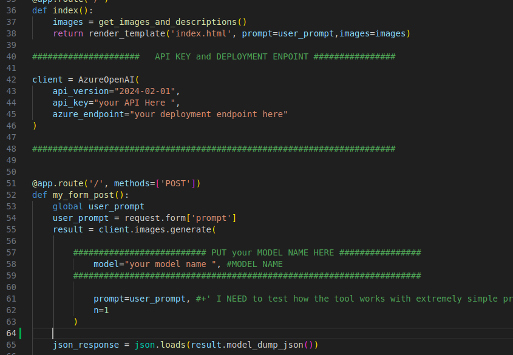
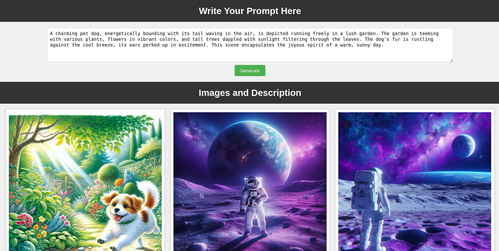
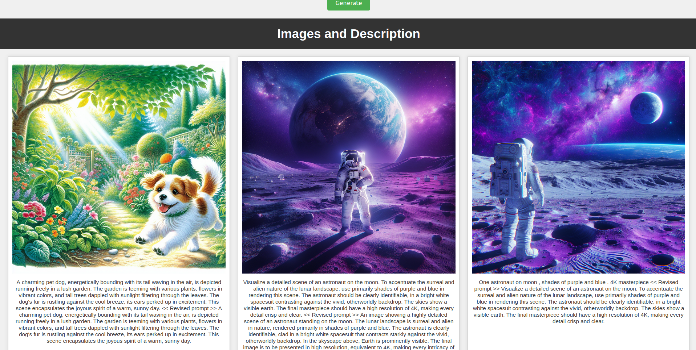

# Search your prompt for consistent character generation.

This is a simple flask webapp with DALLE API which is deployed at azure.

See this guide for more implementation of API:

[API Quick start](https://learn.microsoft.com/en-us/azure/ai-services/openai/dall-e-quickstart?tabs=dalle3%2Ccommand-line&pivots=programming-language-python)

### Install the requirements: (Use virtual environment - recommendation)

``` bash
pip install openai
pip install requests
pip install pillow
pip install Flask
pip install requests
```
## Start the Flask webapp.

``` bash
git clone https://github.com/pongthang/azure_dalle_prompt_test.git
cd flask_images_github
```
## Changes in app.py
In app.py there are big comment lines . Put your API key, Deployment Endpoints and Model Name\



### Then run the webapp
``` bash
python app.py
```
## Open the WebApp at http://127.0.0.1:5000/

You will see similar as following



## Recent images and Prompt

The most recent images along with the prompt you have given and the refined prompt by the AI will be displayed below.



### See the changes in the prompt and improve your workflow.

### Happy Prompt Engineering !!

<br>
<br>

Copyright (c) 2012-2024 Scott Chacon and others

Permission is hereby granted, free of charge, to any person obtaining
a copy of this software and associated documentation files (the
"Software"), to deal in the Software without restriction, including
without limitation the rights to use, copy, modify, merge, publish,
distribute, sublicense, and/or sell copies of the Software, and to
permit persons to whom the Software is furnished to do so, subject to
the following conditions:

The above copyright notice and this permission notice shall be
included in all copies or substantial portions of the Software.

THE SOFTWARE IS PROVIDED "AS IS", WITHOUT WARRANTY OF ANY KIND,
EXPRESS OR IMPLIED, INCLUDING BUT NOT LIMITED TO THE WARRANTIES OF
MERCHANTABILITY, FITNESS FOR A PARTICULAR PURPOSE AND
NONINFRINGEMENT. IN NO EVENT SHALL THE AUTHORS OR COPYRIGHT HOLDERS BE
LIABLE FOR ANY CLAIM, DAMAGES OR OTHER LIABILITY, WHETHER IN AN ACTION
OF CONTRACT, TORT OR OTHERWISE, ARISING FROM, OUT OF OR IN CONNECTION
WITH THE SOFTWARE OR THE USE OR OTHER DEALINGS IN THE SOFTWARE.


